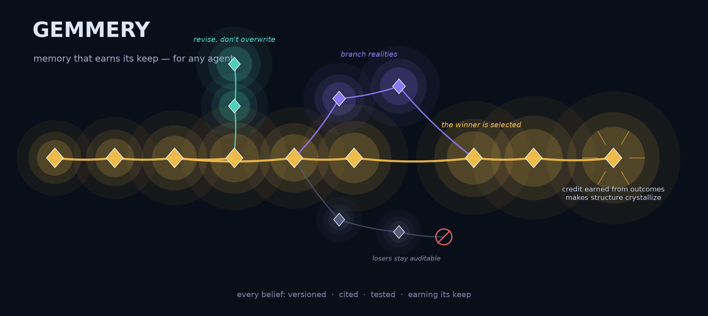
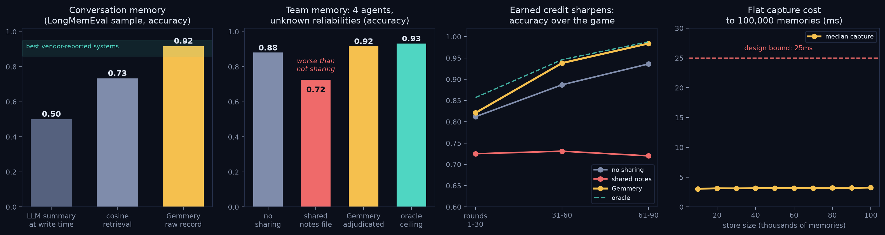

# Gemmery

<p align="center"></p>

**Give your agent a memory that earns its keep.**

Gemmery is a memory system for AI agents — coding agents, research agents,
trading agents, teams of agents. It stores what an agent *learned* —
decisions, rules-of-thumb, falsified assumptions, track records — in a plain
git repository, and holds that memory accountable: every stored item
accumulates a record of real outcomes (tests passing, predictions coming
true, decisions vindicated), items that keep being wrong lose credibility,
and items that keep being right are shown to the agent first at the start
of every new session.

<p align="center"></p>

The same machinery has been measured far outside code: reading opponents in
social-deduction games (1.00 vs 0.36 cold), thirteen years of financial-news
prediction (the credit edge replicated in 13 of 14 years), and teams of
agents pooling unreliable observations (reaching the accuracy of a judge who
knows everyone's true reliability). Details and reproduction scripts below.

> A *gemmery* is where rough stones are kept, cut, and turned into gems.
> Each captured record here is a **gem**; the ones that survive repeated
> testing are the ones worth keeping.

Three properties distinguish it from a notes file or a vector database:

1. **Memory is versioned and immutable.** Records are git commits; nothing
   is ever silently rewritten. When new evidence contradicts an old belief,
   the belief is revised *at the same path* — and the full history of what
   was believed, when, and why stays browsable (plain `git log` works).
2. **Memory earns credit.** Every outcome is appended to a record's
   valuation history, so its standing is computable at any moment — e.g.
   *used in 12 sessions, vindicated in 9, credit +0.7* — rather than taken
   on faith. Failures subtract more than successes add.
3. **The defaults encode measured results — including the failures.** This
   repo doubles as the research program that tried to break its own design;
   what you get are the behaviors that survived, with the losing
   alternatives documented in [FINDINGS.md](FINDINGS.md).

## Vocabulary

Five terms cover everything below:

| term | meaning |
|---|---|
| **gem** | one captured record: a decision or piece of knowledge, stored as a git commit with its reasoning, preconditions, and declared tests |
| **dossier** | an evolving belief kept at a stable path (e.g. `knowledge/why-we-shard-by-day`) and *revised* as evidence arrives — its git history is the story of what was believed when |
| **credit** | a record's earned track record: outcome events appended to its valuation history, folded into win/loss counts and a signed total |
| **librarian** | the automated session-end pass that maintains the store: folds outcomes into credit, captures or revises dossiers, keeps the store packed |
| **headroom** | the gap between what the model does cold and what the task needs — the only place memory can add value |

## Install

**1. Claude Code** (skip if you already use it) — Gemmery's automatic wiring
targets [Claude Code](https://docs.anthropic.com/claude-code), Anthropic's
agentic CLI:

```bash
npm install -g @anthropic-ai/claude-code   # or the native installer from the docs
claude                                      # first run walks you through login
```

There is no separate API key to configure for Gemmery: the librarian's one
model call per session/chapter runs through your existing Claude Code login
and is billed like any other Claude Code usage.

**2. Gemmery** — Python ≥3.11; dependencies (`pygit2`, `numpy`) install
automatically:

```bash
pip install git+https://github.com/jbpayton/gemmery
```

## Quickstart

```bash
cd your-project
gemmery init
```

You should see:

```
store: /path/to/your-project/.gemmery-store
hooks wired in /path/to/your-project/.claude/settings.json: ['SessionStart', 'SessionEnd', 'PostToolUse']
```

Verify any time with `gemmery status`:

```
store:    /path/to/your-project/.gemmery-store  [ok]
memory:   1 gems on main, 1 dossiers in knowledge/
            [[knowledge/importlib-sys-modules-registration]]  v1, 2W/0L, credit +0.20
hooks:    3/3 wired in settings.json (inject, librarian, outcome-hook)
last run: [2026-07-06 22:19] outcomes tagged=1; librarian ops applied=1
```

From then on, three things happen around your normal Claude Code sessions:

- **Session start** — the agent is shown the project's earned dossiers, each
  with its version count, win/loss record, and credit, and is told to cite
  what it uses.
- **During work** — pytest results are appended to an outcome ledger.
  (Currently pytest only; other test runners leave the ledger idle — the
  librarian still works, dossiers just don't earn automatic credit.)
  No model calls, no latency.
- **Session end — and chapter boundaries** (context compaction in long
  sessions) — the librarian folds ledgered outcomes into each dossier's
  credit, records which dossiers the agent actually **cited** this session,
  judges whether each cited dossier helped or misled (a weak-evidence
  valuation, signed separately from test outcomes), and distills anything
  durable the session taught. Typically 0–2 items; "nothing" is a normal
  answer. If the session contradicted a dossier, it revises rather than
  adding. It runs on a small fast model by default (set
  `GEMMERY_LIBRARIAN_MODEL` to change), so the per-run cost is a fraction
  of a cent to a few cents.

Injection is **earned**: dossiers are ranked by credit and citation record,
the top handful are shown in full, and the rest wait behind a one-line
pointer — a dossier that keeps helping rises, one that misleads sinks.

Expect day one to be quiet: the store starts empty, so the first session
injects nothing. After your first session ends, `gemmery status` will show
the librarian's first log line, and dossiers appear as they're earned.

The store itself (`.gemmery-store/`) is gitignored, and it is a normal git
repository — to back it up or share it, give it a remote and push.

The store, library, and CLI are agent-agnostic — any agent that can run a
CLI can capture, browse, and earn credit. The one-command automatic wiring
(`gemmery init`) currently targets Claude Code; wiring another agent
framework means calling the same three commands from its lifecycle hooks.

## What the evidence says

The design was driven by ~20 falsification experiments, each with a
`RESULTS.md` and reproduction scripts under [`experiments/`](experiments/).
The full scorecard is **[FINDINGS.md](FINDINGS.md)**; the headlines
(all scores are accuracy unless noted):

- **Memory only helps where the model fails cold.** On tasks a strong model
  already solves, memory added nothing (Δ≈0.00). The value concentrates in
  experiential, project-specific knowledge the model cannot already have.
- **The raw record beats a bad summary.** On
  [LongMemEval](https://github.com/xiaowu0162/LongMemEval), a long-term
  memory benchmark, careful retrieval over the raw conversation record
  scored **0.917** on our 60-question sample — comparable to the best
  vendor-reported systems (86–95%) — while an LLM that summarized
  everything at write time scored 0.37–0.50. The production design follows
  the resulting rule: *distill judgment, retrieve facts* — dossiers hold
  rules and rationale that cite the raw record, never restatements of it.
- **Bounded memory fails honestly.** Across all four benchmark
  configurations, every one of the 8 questions designed to have no answer
  in memory was correctly answered "I don't know" — no confabulation.
- **Naive shared memory is worse than no sharing.** When four simulated
  agents of unequal reliability shared one last-write-wins file (which is
  what a communal notes file is), team accuracy was *lower* than never
  communicating (0.725 vs 0.881). With disagreements surfaced and resolved
  by each agent's earned credit, the team scored 0.984 — statistically at
  the 0.988 ceiling of a judge who knows the true reliabilities. That
  mechanism — a branch per writer, winners selected onto `main` — is how
  Gemmery handles multiple agents and concurrent sessions.
- **On a real repository, memory won at the margin.** Solving 12
  chronological Django issues, the memory-using agent localized the correct
  file first-try on 12/12 vs 11/12 without memory — the win came from
  citing a librarian-written rule by name against a misleading lead in the
  issue text. One dossier was revised five times, each version narrowing
  its rule against a case that falsified the previous version.

## Performance and hardening

| property | measured result |
|---|---|
| capture latency | ~3ms median, flat from 0 to 100,000 gems (design bound: <25ms) |
| concurrent sessions | a cross-process lock on every write; a 4-process stress test loses zero commits and zero outcome events |
| secrets | credential formats (AWS/GitHub/Anthropic/OpenAI/Slack keys, PEM private-key blocks, JWTs, bearer headers) are redacted before any byte is stored |
| version-history reads | 137ms at 100K gems — 25× faster than `git log`, returning byte-identical results, via a derived cache that is rebuildable from git at any time |
| store size | shrinks ~48× under `git gc`; the librarian runs `gc --auto` each session |
| test suite | 87 tests, including adversarial path/ref torture and multi-process race tests |

## How it's put together

```
gemmery/
├── model.py        # the gem: envelope + typed bodies; three-valued success (pending ≠ 0 ≠ failed)
├── valuation.py    # append-only success/credit notes — the earned track record
├── store/          # git-native store: capture (~3ms), revise, branches, selection,
│                   #   write locks, secrets redaction, fast history reads
├── index/          # derived indexes: columnar (SQLite, exact aggregates) +
│                   #   embeddings (similarity) — rebuildable from git at any time
├── browse/         # budgeted agentic retrieval loop (reformulate → retrieve → assess)
├── prod/           # the production loop: `gemmery init/status/inject/outcome-hook/librarian`
├── eval/           # the original pre-registered evaluation harness
├── skill/          # the Claude skill, incl. the measured decision policy
└── cli.py          # the `gemmery` command
```

Two ideas carry most of the architecture. First, **git is the source of
truth**: every commit's tree is the whole memory state at that moment, so
checking out an old commit materializes exactly what the agent believed at
that point in time, and a diff between branches is a disagreement between
perspectives. Everything else — both indexes, the fast-read cache — is
derived and rebuildable. Second, **the two indexes are complementary
opposites**: embeddings generalize across sparse experience ("have we seen
something like this?"), while the columnar index computes exact totals over
dense sets ("how often was this right?"). Credit *is* an exact aggregate,
which is why a vector store alone cannot provide it.

## Design invariants

1. Immutable record, mutable valuation (append-only notes).
2. Success is test-bound and signed — never a global boolean.
3. `pending` is not `0.0` is not `failed` (three-valued judgment).
4. History and dependency are separate graphs; credit flows along *dependency*.
5. Capture and retrieval are intentional agent actions — the decision to
   record is itself signal. Never a background daemon.
6. Git is the source of truth; all indexes are derived.
7. Selection over merge: explore on branches, cherry-pick winners to `main`.
8. Git rewinds *epistemic* state, not the world — irreversible effects need
   compensation, not rewind.
9. Capture is cheap (<25ms; measured ~3ms).

## Going deeper

- **[FINDINGS.md](FINDINGS.md)** — every result that shaped the design,
  positive and negative, with links to the experiment that produced it.
- **[`experiments/`](experiments/)** — the reproduction scripts and
  per-experiment write-ups.
- **[`gemmery/skill/SKILL.md`](gemmery/skill/SKILL.md)** — the skill an
  agent reads, including the eight-point decision policy distilled from the
  experiments.
- **[`tools/prod/README.md`](tools/prod/README.md)** — the live
  self-hosting loop (this repo runs Gemmery on itself) and its evaluation
  gate.
- **[`IMPLEMENTATION_NOTES.md`](IMPLEMENTATION_NOTES.md)** — design
  decisions and their reasons.

```bash
python -m pytest                       # the full suite
python -m gemmery.eval.run_phase0      # the original evaluation harness, end to end
```

## Status

v0.2.0. Store, production loop, and skill are hardened and in daily
self-hosted use. Not yet on PyPI; install from git.
